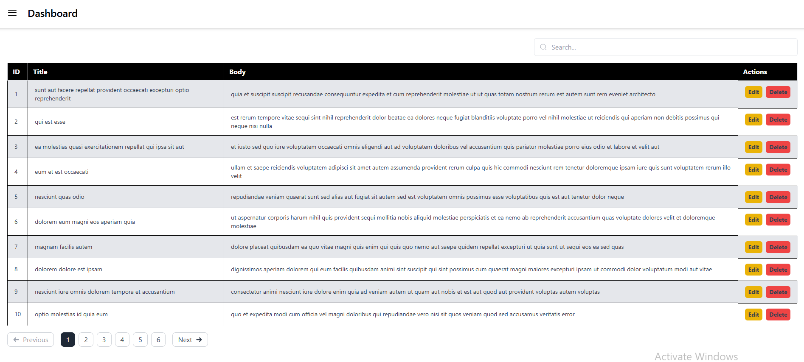

# 📋 Project Name

A simple DashBoard application built with **React** that allows users to create, edit, delete, and search posts with pagination support.

---

## 🚀 Setup Instructions

1. **Clone the repository**
   ```bash
   git clone https://github.com/your-username/your-repo-name.git
   cd your-repo-name
2. Install dependencies
npm install

3. Start the development server
npm run dev
Open your browser at http://localhost:5173 (if using Vite) or http://localhost:3000 (if using CRA).

✨ Features
. 📄 CRUD Operations — Create, Edit, Delete posts dynamically.
. 🔎 Search — Filter posts by title or body.
. 📑 Pagination — Displays 10 posts per page with navigation.
. 🖋️ Modal Form — User-friendly modal for adding or editing posts.
. 🎨 Responsive UI — Styled with Tailwind CSS for a clean, modern look.
. ⚡ React Context API — Used for global state management.

🔗 API Endpoints Used
Method	Endpoint	      Description
GET	    /api/posts	    Fetch all posts.
POST	  /api/posts	     Add a new post.
PUT	    /api/posts/:id	 Update a specific post.
DELETE	/api/posts/:id	Delete a specific post.

💡using API from https://jsonplaceholder.typicode.com/

📷 Screenshots 
<p align="center">
  
</p>

🛠️ Tech Stack
React 18
Tailwind CSS
React Context API
